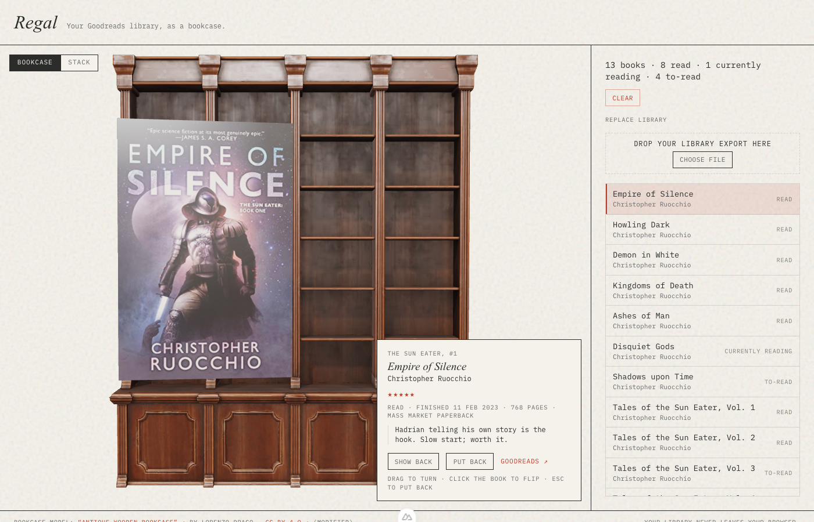

# Regal

*Regal* is German for shelf.

A reading library as a 3D bookcase. Pull a book off the shelf, turn it around, see what you thought of it.

Regal is only the display: it renders one input, the [Regal library file](docs/library-file.md). Where the reading data comes from (a reading tracker, Goodreads, [Libellus](https://github.com/fabkho/libellus)) is the business of whatever writes that file, a **Pipeline**.

Built with Nuxt 4 and [TresJS](https://tresjs.org) (three.js for Vue).

## What it does

- Point it at a Regal library file (the site shows a demo; `?src=<url>` any other) and its Books stand on an antique Bookcase — sized by page count and binding, grouped by Reading status.
- Covers, Spines and backs come with the file. What it lacks is drawn: a placeholder front, the colour sampled from the front's left edge, title and author typeset along the Spine, the blurb and ISBN barcode on the back.
- Hover a Book: it eases forward and catches the light. Click: it comes out to you showing its Cover; click again for the back, again to put it away. Drag to spin it.
- The picked Book's details (rating, review, blurb, Goodreads) come in a card beside it; on narrow screens a bottom sheet under it, at most 40% of the stage tall, that scrolls inside and puts the Book back when dragged down.
- **Stack** view: the whole Library as one pile you scroll through smoothly (wheel, drag, arrow keys; on touch a flicked finger glides on). Books passing the middle of the view fan out like pages flipped through, the centred one most, with its title and stars beside it (a caption on narrow screens): the hover for scrolling and phones.



Spec and roadmap: [#1](https://github.com/fabkho/regal/issues/1).

## Development

```bash
pnpm install
pnpm dev          # http://localhost:3000 — the demo library file; /?src=<url> views another
pnpm test         # unit + nuxt + browser e2e
pnpm lint
```

The site is a viewer: it shows `librarySrc` (default: the synthetic demo library, `demo/demo-library.json`, served at `/demo-library.json`; `NUXT_PUBLIC_REGAL_LIBRARY_SRC` points it elsewhere) and `?src=<url>` views any library file. A `?src=` file is loaded by the browser only, never through the server, so it must allow cross-origin requests from the site.

Clicking in the 3D has a fuzz test: with the app running, `node scripts/pick-fuzz.mjs --url http://localhost:3000 --seeds 1,2,3 --steps 200` drives random clicks, drags, scrolls, re-sorts and Escapes in a headless browser and checks the Pick after each one (it loads `/?view=stack&debug=pick`; `--view bookcase`, `--src <url>` for another library file, e.g. your own converted one).

## Use Regal as a Nuxt layer

Regal is also a [Nuxt layer](https://nuxt.com/docs/guide/going-further/layers): another Nuxt 4 app can extend it and show a Library on one of its own pages (the portfolio's `/books`). The host gets two components and their composables, nothing else: no Regal page, no server routes, no global CSS, no page title, no dev panel, no demo data.

### Extend it

```ts
// nuxt.config.ts of the host app
export default defineNuxtConfig({
  // Deploys: from GitHub (the layer's dependencies are installed with it).
  // Pin a branch or tag with a ref: 'github:fabkho/regal#main'.
  extends: [['github:fabkho/regal', { install: true }]],
  // Local development against a checkout: extends: ['../regal/'] (trailing slash).

  runtimeConfig: {
    public: {
      regal: {
        librarySrc: '/books/library.json',
      },
    },
  },
})
```

### Config: `runtimeConfig.public.regal`

| Key | Default | Meaning |
|---|---|---|
| `librarySrc` | `''` | URL of the [Regal library file](docs/library-file.md) to show: absolute, or relative to the page (`/books/library.json` from the host's `public/`). Unset: the components show an error saying so. |

Env override as usual: `NUXT_PUBLIC_REGAL_LIBRARY_SRC=…`.

**Changed with the library file** ([#39](https://github.com/fabkho/regal/issues/39)): `mode` and `assetsBase` are gone. There is one way to get a Library (the file at `librarySrc`, its images listed in it), so a host that still sets them gets no error, they are ignored; drop them when you switch. `librarySrc` now names a library file, not a reading-tracker export (Libellus writes one; `pnpm library:convert` converts old published data, see below); such an export shows the error card. The Cover and description resolvers (`/api/cover`, `/api/description`, `NUXT_GOOGLE_BOOKS_API_KEY`) are no longer part of the layer.

### Components

```vue
<!-- body -->
<RegalBooksStage class="books-stage" />
<!-- the host's sidebar -->
<RegalBooksSidebar heading="Bookshelf" count-label="Books read" />
```

- **`RegalBooksStage`**: the 3D Stack only (no Bookcase/Stack switch), the picked Book's details card over it (a bottom sheet on narrow stages). Give it a height (it fills its box; `min-height: 24rem`). Prop `controls` (default `false`) adds the sort & filter chips over the 3D.
- **`RegalBooksSidebar`**: the count of read Books, the Stack's sort/year/rating filters and the Books as records (hover lifts the Book in the 3D, click takes it out). Props: `heading` (`'Bookshelf'`, `''` hides it), `countLabel` (`'Books read'`), `filters` (`true`), `list` (`true`). Fills the height it gets; the records scroll.

Both load the Library from `librarySrc` themselves (server-side when possible, so the records are in the HTML; one fetch) and share it, the Stack's sort & filters (kept in the URL: `?sort=rating&year=2025&min=4`; `group=year|month|off` sets the date separators, default by year), the picked Book and the hovered one. They work on the same page in any layout, also when one sits in a layout and the other in the page.

The look is the decided one: re-sorts move by hand when up to 3 Books move, as a carousel above that; Books a filter brings back pop in scattered around the pile and leaving ones slide out and shrink away, and when no Book stays (a new year) the old pile sweeps out to the left before the new one settles in from the bottom up (instant with reduced motion); classic back covers; title and stars in the hover label; while you scroll the Stack (and on touch screens), Books passing the middle of the view riffle out, the centred one with that label.

**Styling.** The components use the paper-ink tokens with fallbacks, e.g. `var(--color-ink, #2C2C2A)`, so they look right with or without them. A host that defines the same tokens (`--color-bg`, `--color-ink`, `--color-ink-muted`, `--color-ink-faint`, `--color-line`, `--color-accent`, `--color-accent-tint`, `--font-mono`, `--font-serif`, `--text-2xs` … `--text-2xl`) restyles them; set them on a wrapper to change only Regal. Regal registers the IBM Plex Mono, Patua One and Antonio `@font-face`s (no other global CSS).

Regal's composables (`useLibrary`, `useBookPick`, `useStackView`, `useRegalConfig` …) are auto-imported into the host too; avoid those names in the host.

### Static data

Regal reads one file: the [Regal library file](docs/library-file.md) (`version: 2`), every Book with its data and resolved assets (front, Spine and back images, small pile copies, Spine colours, blurb), validated when it loads. Put it anywhere (the host's `public/`, a CDN) and point `librarySrc` at it.

- Image references in it are absolute or relative to the file's own URL (`9780756413026/front.webp` next to the file). Images on another origin must allow CORS, as they become WebGL textures.
- A Book without an image gets the drawn one: a placeholder front, a typeset Spine and back.
- A file that doesn't load or isn't valid (another `version`, a reading-tracker export, a broken field) shows an error card with the first problems (`books[3].rating: must be …`), never an empty shelf.
- The Stack loads lazily from the file's `pile` copies: the Spines in and around the view first, then the rest of the pile in the background, and a Book's full front and back only once it is pointed at or taken out. Without `pile` copies the full faces stand in; without `palette` the Spine colours are sampled from the front in the browser.

`nuxt dev` note: a `public/books/` folder next to a `/books` page makes the dev server redirect `/books` to `/books/` (the page still renders). Production builds don't.

`tests/fixtures/layer-host/` is a minimal host (a synthetic library file) built by `tests/e2e/layer-host.test.ts`; `pnpm nuxi dev tests/fixtures/layer-host` runs it.

## Producing the library file

Three steps, each with one job:

```
Libellus (library:convert: bridge for old data) ──► library file ──► regal assets ──► library file + images (R2 v2/) ──► Regal display
```

1. **Produce.** Something writes a [Regal library file](docs/library-file.md) with the reading data. Today that is [Libellus](https://github.com/fabkho/libellus) (`pnpm export:regal`, see [The daily chain](#the-daily-chain)). `pnpm library:convert` stays as a bridge for old published data: it turns a v1 `library.json` + `manifest.json` into a library file ([Converting](docs/library-file.md#converting-old-published-data)). Where the data comes from is the producer's business, not Regal's.
2. **Enrich: Regal assets** ([`pipeline/`](pipeline/README.md)). Takes any library file and returns it with each Book's `assets` (front, Spine, back, pile copies, palette, Spine colour, photo faces, source) and the images, plus a blurb for Books without one.
3. **Display.** Regal (this layer) renders the enriched file, nothing else.

### Running Regal assets

`pipeline/` is its own package (own `package.json` and lockfile, never installed by a host that extends the layer):

```bash
pnpm --dir pipeline install
pnpm regal-assets --in .data/library-v2.json --dry-run --no-ai   # = pnpm --dir pipeline assets …
```

- `--in <file|url>`: the library file, validated with the shared validator (invalid: the errors, nothing written). `--out <dir>` (default `.data/regal-assets/out`): `library.json` plus `<key>/{front,spine,back,front-pile,spine-pile}.webp`, `<key>` the ISBN-13 or the Book id; image references in the output are relative to it.
- Per Book: what the file brings and is good enough stays (copied into the output, so the published set doesn't depend on where the input's images live); a front below 800 px or none goes through today's front chain (Apple, the German National Library for German editions, Google, the file's own front, Open Library), the taller one wins; photo drop-ins (`<cache>/photos/<key>/front.jpg` …) beat everything; pile copies, palette and Spine colour are made from the faces; a Book without a blurb gets one (Apple's publisher copy, else Open Library/Google).
- AI Spines/backs (Gemini, `GEMINI_API_KEY` with billing) for Books with a front and no Spine/back art, through the Batch API (half price; `--now` for direct calls). A paid jacket is kept in the cache and never bought twice. `--no-ai` leaves them to Regal's drawn ones, `--no-model` skips the text model too.
- Incremental and idempotent: a Book is rebuilt only when what its assets are made of changed (its sizing and text fields, its input images' content, its photos); a run without changes rewrites nothing, not even `generatedAt`. Downloads, jackets, open batch jobs and the state live under `.data/regal-assets/` (`--cache`). `--revalidate` asks the servers whether input images changed behind the same URL; `--force` rebuilds anyway; `--limit <n>` takes only the n most recently read Books this run.
- `--publish v2` uploads what changed to the R2 bucket (`$REGAL_R2_BUCKET`, default `portfolio-books`, `wrangler login` once) under `v2/`: images first, `library.json` last, files that are gone deleted. Only that prefix is ever written; the bucket root (the old v1 files) never, and an empty prefix is refused.
- `--dry-run`: nothing remote and nothing paid. No upload (the plan is printed), no Gemini call (the AI cost is printed, as today's build did); the free work runs and the local output is written, so the dry run shows the enriched file.

Books without a blurb now get theirs from Regal assets: the display has no description resolver any more, so a file that skips this step shows them without one.

**CORS.** The portfolio loads the images cross-origin as WebGL textures, so the bucket's domain (`books.fabkho.dev`) must answer with CORS headers for the page's origin (`https://fabkho.dev`, and any preview/dev origin that shows `/books`), for `v2/` as for the old v1 files.

### The daily chain

The owner's daily job (09:00, outside this repo) runs two commands: [Libellus](https://github.com/fabkho/libellus) (hosted Supabase) writes the library file, and a Regal checkout enriches and publishes it under `v2/`:

```bash
# 1. in Libellus: reading data → library file, keeping the art already published
pnpm export:regal --carry-art https://books.fabkho.dev/v2/library.json
# 2. in a Regal checkout: enrich and publish under v2/ (no AI in the daily run)
pnpm regal-assets --in <the file from step 1> --no-ai --no-model --revalidate --publish v2
```

`--carry-art` keeps each Book's published front, Spine and back, matched by ISBN-13, else by title plus the first author's surname, so the export doesn't have to make them again. Step 2 is quick when nothing changed (every Book cached): a quiet day uploads nothing. The portfolio reads `books.fabkho.dev/v2/library.json` ([#41](https://github.com/fabkho/regal/issues/41)). The old reading-tracker build (`books:daily`) and the `library:convert` step are retired from the job; retiring the v1 R2 data is [#48](https://github.com/fabkho/regal/issues/48).
