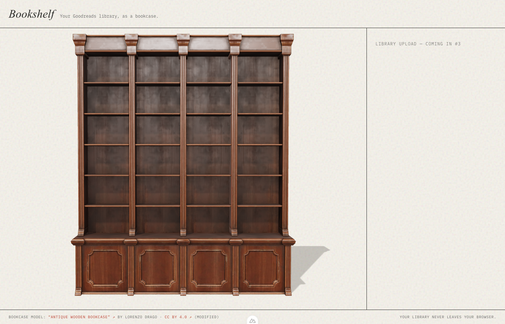

# bookshelf-3d

Upload your Goodreads library export and browse it as a 3D bookcase. Pull a book off the shelf, turn it around, see what you thought of it.

Built with Nuxt 4 and [TresJS](https://tresjs.org) (three.js for Vue).

## Status

In progress. Spec: [#1](https://github.com/fabkho/bookshelf-3d/issues/1). The Bookcase scene is in place; Books land on its Shelves next.

The Shelf surfaces are measured from the model and committed as data (`app/utils/bookcase/shelves.ts`); `?debug=slots` draws a box on each of the 24 slots.

## Getting your Goodreads export

Goodreads → My Books → Import and export → **Export Library**. You get `goodreads_library_export.csv`. The file is parsed in your browser; only ISBN, title and author are sent to the server to look up covers.
