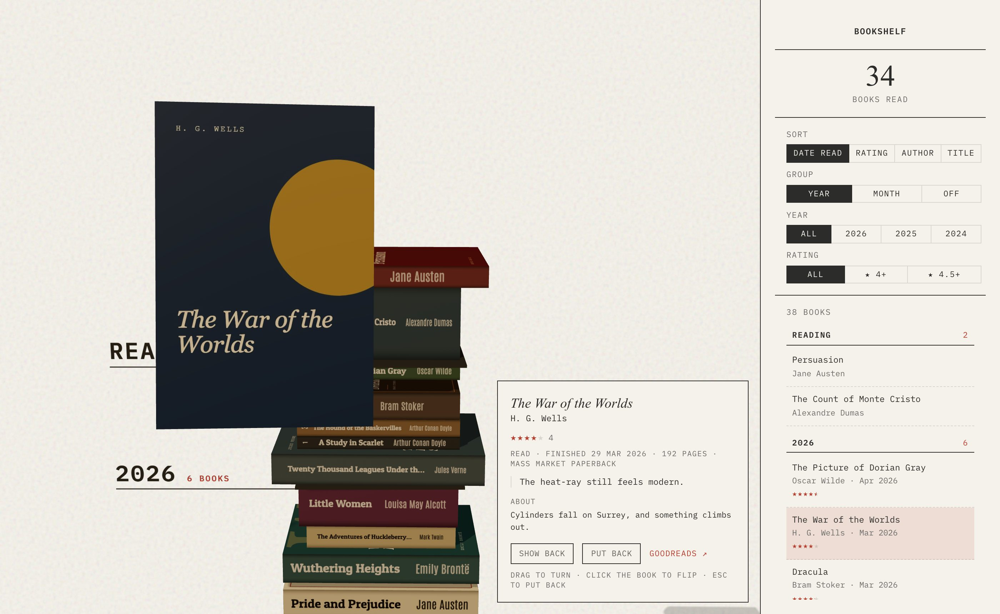
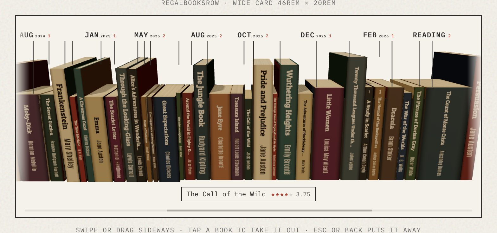
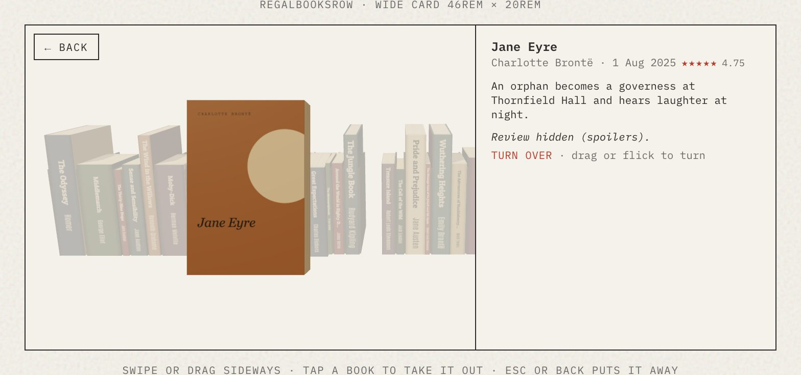
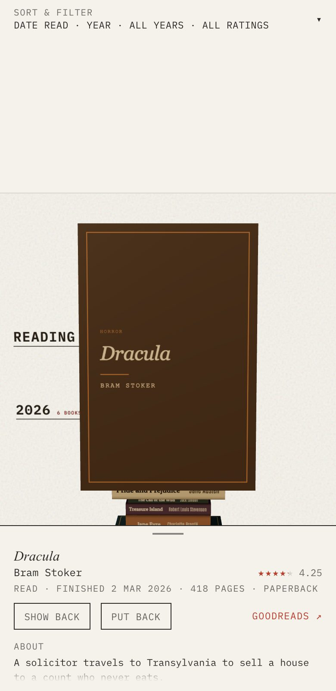
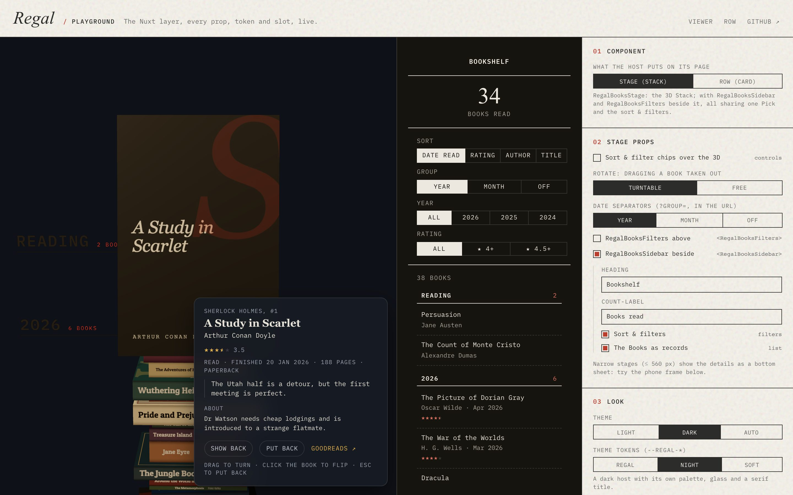

# Regal

*Regal* is German for shelf.

A reading library as a 3D stack of books, for your own site. Pull a Book out, turn it around, read what you thought of it.

**[Playground](https://fabkho.github.io/regal/playground)** (every setting, live) · **[Demo](https://fabkho.github.io/regal/)** (my real shelf, on GitHub Pages; `pnpm dev` runs both locally with synthetic data) · [Nuxt layer reference](docs/nuxt-layer.md) · [Library file format](docs/library-file.md) · [Producing and publishing](docs/producing.md)



Regal is a [Nuxt](https://nuxt.com) layer built with [TresJS](https://tresjs.org) (three.js for Vue). Add it to a Nuxt 4 app, point it at one JSON file, and put its components on a page:

- **The Stack** (`RegalBooksStage`): your Books as one pile you scroll through, sized by page count and binding, grouped by year or month, what you're reading on top. Hover a Book and it eases forward; click it and it comes out to you, front first, then the back, with your rating, review and the blurb beside it.
- **The sidebar and the filter bar** (`RegalBooksSidebar`, `RegalBooksFilters`): the count, sort and filters (kept in the URL), and the Books as records linked to the 3D.
- **The row** (`RegalBooksRow`): the Stack turned on its side for a card on another page (a profile, a year in review), the months marked above it.
- **Phones**: the details become a bottom sheet, the row can break out to the whole screen, swipes and haptics feel native.
- **Your look**: light, dark or following your site, every colour, frame and font a CSS token, your own markup in slots.

| | |
|---|---|
|  |  |
|  |  |

*All screenshots show the synthetic showcase shelf (`demo/showcase-library.json`): public-domain titles with invented data and covers drawn by `scripts/showcase/covers.mjs`, made with `scripts/showcase/shots.mjs`.*

## How it works

```
producer ──► Regal library file ──► Regal assets (optional) ──► library file + images on any static host ──► Regal (this layer) on your page
```

- **The display (this layer)** renders one input, the [Regal library file](docs/library-file.md): a versioned JSON with every Book, its reading data and its images. It never reads a source itself: no Goodreads import, no API keys, no server routes.
- **A producer** writes that file: [Libellus](https://github.com/fabkho/libellus) (a reading tracker), a converter for older data, or you, by hand ([Producing](docs/producing.md)).
- **Regal assets** ([`pipeline/`](pipeline/README.md), optional) fills in what the file lacks: covers, Spine and back art, small pile copies, Spine colours, missing blurbs. Without it, Regal draws the Spines and backs itself.

## Use Regal as a Nuxt layer

You need a Nuxt 4 app (Node 22.12 or newer).

**1. Extend Regal** in `nuxt.config.ts`, and tell it where the library file is:

```ts
export default defineNuxtConfig({
  extends: [['github:fabkho/regal', { install: true }]],
  runtimeConfig: {
    public: {
      regal: { librarySrc: '/books/library.json' },
    },
  },
})
```

**2. Add a library file.** To start, copy the demo: [`demo/demo-library.json`](demo/demo-library.json) to `public/books/library.json`. [Producing](docs/producing.md) has your own.

**3. Put the components on a page** and give the stage a size (it fills its box):

```vue
<!-- app/pages/index.vue -->
<template>
  <main class="books">
    <RegalBooksStage class="books__stage" />
    <RegalBooksSidebar class="books__sidebar" heading="My shelf" />
  </main>
</template>

<style scoped>
.books { display: grid; grid-template-columns: 1fr 22rem; height: 100dvh; }
.books__sidebar { overflow: auto; padding: 1rem; }
</style>
```

**4. `npx nuxi dev`.** The Stack, the records and a picked Book's details are there. A card elsewhere: `<RegalBooksRow style="height: 18rem" :year="2025" />`.

Each component loads the library file itself (server-side when it can, one fetch per page) and they share it, the Pick and the filters. No global CSS beyond three `@font-face`s, no pages, no server routes come with the layer.

### Config: `runtimeConfig.public.regal`

| Key | Default | Meaning |
|---|---|---|
| `librarySrc` | `''` | URL of the [Regal library file](docs/library-file.md): absolute, or relative to the page (`/books/library.json` from the host's `public/`). On another origin it, and its images, need CORS ([why](docs/nuxt-layer.md#cors-for-the-image-host)). Unset: the components show an error saying so. |
| `theme` | `'light'` | Colour scheme of the tooltip, the detail panel and the row's card where a component doesn't set `theme`: `'light'`, `'dark'` or `'auto'` (follows the host). |
| `haptics` | `true` | Short vibrations on phones that can (Android Chrome) when a Book is taken out or put back and while a finger scrolls. `false` turns them off. |

Env overrides work as usual: `NUXT_PUBLIC_REGAL_LIBRARY_SRC=…`, `NUXT_PUBLIC_REGAL_THEME=auto`, `NUXT_PUBLIC_REGAL_HAPTICS=false`.

### Components

| Component | What | Main props |
|---|---|---|
| `RegalBooksStage` | The 3D Stack and the picked Book's details (a bottom sheet on stages ≤ 560 px). | `controls`, `rotate`, `theme`, `unstyled`; slots `#tooltip`, `#detail…` |
| `RegalBooksSidebar` | Count, sort & filters, the Books as records, linked to the Stack. | `heading`, `count-label`, `filters`, `list`, `theme`, `unstyled` |
| `RegalBooksFilters` | The same sort & filters as one bar, for a phone. | – |
| `RegalBooksRow` | The Stack turned 90° for a card; its own Pick. | `inspect` (`card`/`viewport`/`auto`), `limit`, `year`, `rotate`, `back-button`, `label`, `theme`, `unstyled`; slots `#tooltip`, `#detail…`, `#back` |

Every prop, slot and behaviour, the composables, `preloadRegal()` and the host notes (lazy loading, PWA precache, CORS, fabkho.dev/books and Libellus as examples): **[docs/nuxt-layer.md](docs/nuxt-layer.md)**. To see them: the **[playground](https://fabkho.github.io/regal/playground)**.

### Loading errors and retry

A library file that doesn't load (offline, a 5xx, CORS, bad JSON, an invalid file) shows an error card with **Try again**; the failure is never kept as the answer. The next mount of a component asks for the file again, and a file that loaded stays for the page (a remount makes no request). `preloadRegal()` follows the same rule: a failed warm-up is dropped, not kept.

A host with its own "Try again" calls `retry()` from `useRegalLibrary()` (no need to know Regal's state):

```vue
<script setup lang="ts">
const { error, loading, retry } = useRegalLibrary()
</script>

<template>
  <RegalBooksRow />
  <button v-if="error" :disabled="loading" @click="retry()">Try again</button>
</template>
```

`retry()` fetches the file again after a failure and resolves once the result is shown; calls and mounts while a request is on its way share it, and while the Library is shown it does nothing. Details: [Loading errors and retry](docs/nuxt-layer.md#loading-errors-and-retry).

> **Changelog.** Hosts can drop workarounds like resetting `useState('regal:library-loaded')` before remounting the row to retry: a remount asks for the file again by itself, and `retry()` is the explicit call.

### Theming

Three levels, the same on the Stage and the row: **tokens** (`--regal-surface`, `--regal-ink`, `--regal-accent`, `--regal-radius`, `--regal-font-title` … on any wrapper), **`theme`** (`light`, `dark`, `auto`), and **slots** for your own markup, with **`unstyled`** for full control. The sidebar and filters read the paper-ink tokens (`--color-ink`, `--color-bg` …) with fallbacks. The row's backdrop behind a Book taken out is a token too: `--regal-veil-opacity` (broken out, `0.9`; `1` is solid), `--regal-veil-opacity-card` (`0.72`) and `--regal-veil-color` (default: the card's surface). Token table, slot props and examples: [Theming](docs/nuxt-layer.md#theming).

## Producing the library file

- **From Libellus**: `pnpm export:regal` there, or its `regal-export` function.
- **From older published data** (the reading-tracker/Goodreads era): `pnpm library:convert`.
- **By hand**: it's plain JSON; validate it by dropping it on the playground.
- **Then, optionally, Regal assets** for covers, Spines, backs and colours: `pnpm --dir pipeline install`, then `pnpm regal-assets --in my-library.json --dry-run --no-ai` first (nothing remote, nothing paid, the AI cost printed).
- **Publish** the file and its images on any static host, or R2 with `--publish <prefix>`.

All of it, with the flags and the costs: **[docs/producing.md](docs/producing.md)**. The format: **[docs/library-file.md](docs/library-file.md)**.

### The daily chain

The owner's shelf on [fabkho.dev/books](https://fabkho.dev/books) is published by [`publish-shelf.yml`](.github/workflows/publish-shelf.yml): Libellus' export → validate → Regal assets → R2 `portfolio-books/v2/`, daily and whenever the Library changes. Secrets, guards and dry runs: [The daily chain](docs/producing.md#the-daily-chain).

## Development

```bash
pnpm install
pnpm dev               # http://localhost:3000: the viewer (demo library file); /playground; /row; /?src=<url> views another file
pnpm lint
pnpm test:unit         # pure modules
pnpm test              # + Nuxt runtime + browser e2e (builds the app; WebGL in headless Chromium)
pnpm typecheck
pnpm check:privacy     # fails on real exports or publisher images in the repo
pnpm generate          # the static site; NUXT_APP_BASE_URL=/regal/ for a subpath
```

The site is a viewer of one library file (`librarySrc`, default the synthetic demo) and `?src=<url>` views any other; a `?src=` file is loaded by the browser only, so it must allow cross-origin requests from the site. `/playground` is the showcase. Both, and the dev pages, stay out of an app that extends the layer.

The showcase is deployed to GitHub Pages from `main` by [`pages.yml`](.github/workflows/pages.yml) (a static `nuxt generate` under `/regal/`). There it shows the owner's real shelf: `REGAL_SITE_SHELF_SRC` (and `REGAL_SITE_SHELF_NAME`) at build time make a published library file the site's default and the playground's first choice. The browser loads it from where it's published (its CORS policy must allow the site's origin); the viewer pages then render in the browser only, so no record is baked into the build. Unset, as in `pnpm dev` and the tests, the site uses the synthetic files.

Clicking in the 3D has a fuzz test: with the app running, `node scripts/pick-fuzz.mjs --url http://localhost:3000 --seeds 1,2,3 --steps 200` drives random clicks, drags, scrolls, re-sorts and Escapes in a headless browser and checks the Pick after each one (`--view bookcase`, `--src <url>` for another library file).

`tests/fixtures/layer-host/` is a minimal host app that extends the layer (synthetic data); `pnpm nuxi dev tests/fixtures/layer-host` runs it.

## Contributing

Regal is a personal project and doesn't take outside contributions: pull requests are limited to collaborators. You're welcome to fork it under the licence below. Report security problems privately (next section).

Notes for working on it:

- Before a commit: `pnpm lint`, `pnpm test:unit`, `pnpm typecheck` and `pnpm check:privacy` (CI runs the same, and the pipeline's tests). The e2e suite is local only.
- **Never commit real reading data**: no Goodreads export, no personal library file, no reviews or notes of a real person. Fixtures are synthetic (`Ada Example`, invented ISBNs).
- **Never commit publisher images**: covers, Spines and backs found by Regal assets, or screenshots showing them. Screenshots come from the synthetic showcase shelf (`node scripts/showcase/shots.mjs <site>`).
- The layer must stay host-safe: anything for Regal's own site goes in the standalone-only module in `nuxt.config.ts`; see [AGENTS.md](AGENTS.md) for the conventions and [CONTEXT.md](CONTEXT.md) for the vocabulary (Book, Stack, Pick, Spine …).

## Security

Regal renders a library file in the browser and runs no server code in a host. Report a vulnerability privately through [GitHub's security advisories](https://github.com/fabkho/regal/security/advisories/new), not in an issue: [SECURITY.md](SECURITY.md).

## Licence and credits

The code is [MIT](LICENSE) licensed. Exceptions, each under its own licence: the bookcase model (`public/models/bookcase.glb`, CC BY 4.0, Lorenzo Drago) and the IBM Plex Mono subset (`app/assets/fonts/`, SIL Open Font License 1.1, [`OFL.txt`](app/assets/fonts/OFL.txt)); details in [CREDITS.md](CREDITS.md).

Book titles, covers and blurbs that appear in a library file you load belong to their publishers and authors; Regal ships none. The live site's default shelf is the owner's real one, loaded from `books.fabkho.dev` and not part of this repository. The demo and showcase libraries (`demo/`) are synthetic and illustrative: well-known titles with invented ratings, dates, reviews and ISBNs; the showcase's covers are drawn for it, no publisher's art.
