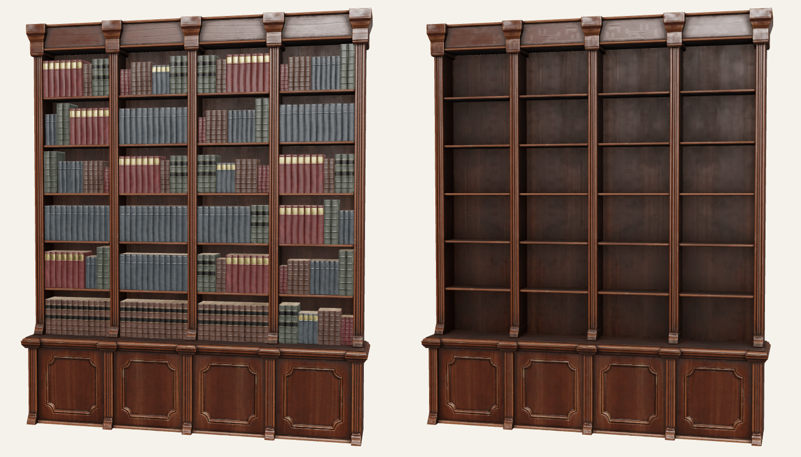

# Bookcase model

**Source:** [Antique wooden bookcase - Game model](https://sketchfab.com/3d-models/antique-wooden-bookcase-game-model-75aa9519195647d99cf1e2d4863dbe87) by [Lorenzo Drago](https://sketchfab.com/LorenzoDrago), licensed [CC BY 4.0](https://creativecommons.org/licenses/by/4.0/). Credit must stay visible in the app.

**Obtained without a Sketchfab account** via the Objaverse mirror (Allen AI, Hugging Face):
`https://huggingface.co/datasets/allenai/objaverse/resolve/main/glbs/000-009/75aa9519195647d99cf1e2d4863dbe87.glb` (5.6 MB)

**Processing** (`strip.mjs`, gltf-transform 4.5.1 + sharp 0.35.5):
1. Removed the 24 bundled `book-stacks` meshes and their material/textures.
2. prune + dedup.
3. Textures → WebP (`EXT_texture_webp`), max 2048², quality 85.

Result: `public/models/bookcase.glb`, 295 KB. One mesh (`bottom_lp.001_bookcase_0`), one PBR material (`bookcase`: baseColor, ORM, normal).

**Model units:** bounds x ±1.918, y 0→4.511, z 0→0.679. Scale in-app to real-world metres. 4 bays × 6 shelves above a cabinet base; open back.

